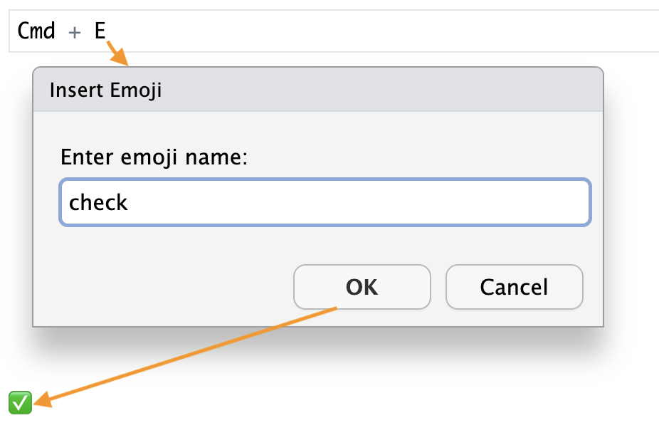
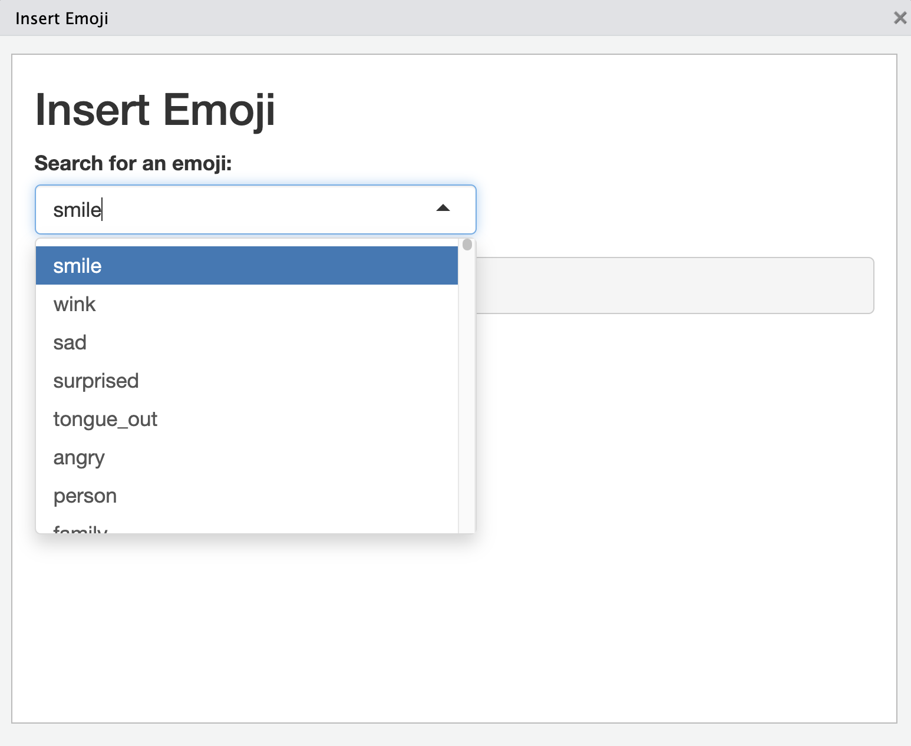
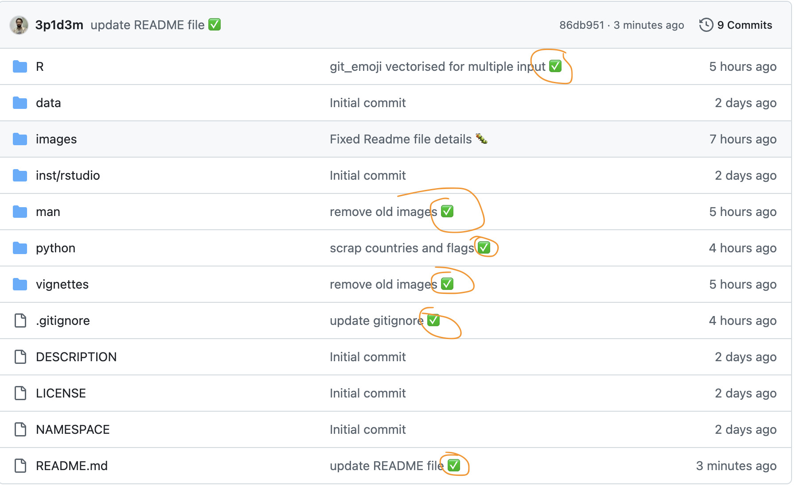

# 

The **Rmoji** package makes it easy to insert emojis 😎 into your R scripts, R Markdown, Quarto documents and your shiny dashboards and websites. It’s a fun and expressive way to enhance your code, reports, and git commits!

# 🚀 Installation

To install the development version from your local folder or GitHub:

``` r

# From local (path in your computer after downloading the devlopment version)

 devtools::install("path/to/Rmoji") 

# From GitHub 

 devtools::install_github("3p1d3m/Rmoji")
```

# ✨ Features

`` 🔹`insert_emoji()` – Inserts emojis with name-based auto completion. ``

`` 🔹`insert_emoji_subset` - To subset the the first/last n, number of emojies. ``

`` 🔹`insert_emoji_addin()` – A GUI addin to select and insert emojis. ``

`` 🔹`emoji_shortcut()` – Add to RStudio keyboard shortcuts. ``

`` 🔹`git_emoji()` – Easily add emojis to your Git commit messages. ``

`` 🔹`emoji_list()` – View the full emoji dictionary. ``

`` 🔹`shiny_emoji ()` - shiny addin with drop down option ``

# 🔧 Example Usage

``` r
library(Rmoji)

insert_emoji("star")
⭐
insert_emoji("cake")
🍰
git_emoji("gift")
🎁

emoji_list() # show all emojies

check           ✅
cross           ❌
warning         ⚠
info            ℹ
question        ❓
stop            🛑
...
```

# ⌨️ Keyboard short

The main advantage of this package is to visually insert the emoji using the keyboard shortcut. To custom create a short cut, go to your `Rstudio-->Tools-->Modify keyboard shortcuts`, then search for `Emoji shortcut addin` and hit the short cut you want to assign in your keyboard. Mine is `Cmd + E`. Assign yours as you feel comfortable. Once the keyboard shortcut is assigned, a popup screen for input will be displayed on each encounter, and the Emoji name can be provided in the query. On clicking enter in your keyboard, it will insert the Emoji, without any code in the cursor line.



✅ this is quick cause you don’t have a shiny popup, and it inserts on a click.

❌ The backlash is you you have to remember the name of the emoji. However you can also print all the emojis and names in the console using the `emoji_list()` function and you can check the name.

# 💻 Shiny addin and Keyboard Shortcut with Dropdown 🎉

Since we have thousands of of emojis and sometime hard to remember them by name, there is a shiny option with drop-down to select the proper emoji. It is available in the addins as `shiny emoji` and it can also be assigned to any keyboard shortcut. in R studio go to `Tools`—\>`modify keyboard shortcuts` —\>`shiny emoji` then hit the short cut you wanted in your keyboard. mine is `Shift + E`. This will pop up a shiny up with options to search and select form the drop down.



# 💻🔧 Adding the Emoji to Your Commit Message

Now, you can include the emoji in your Git commit message. Here’s an example of how to make a commit in Git, using the system() function to execute Git commands directly from R console:

``` r
system("git status") # to check the git status 

system("git add {file}")  # Replace with your file name

system("git add -a") # To push all changes at once, less recommende

bug_emoji <- git_emoji("bug") # create the emojy you wanted to push

commit_message <- paste("Fixed the issue with user authentication", bug_emoji)

system(paste("git commit -m", shQuote(commit_message)))
```

## Pushing the Commit to GitHub

If you want to push the commit to your GitHub repository, you can do so by executing the following command from R:

``` r
# Push the commit to the remote repository

system("git push origin main")  # Replace "main" with your branch if different
```



If you wanted to put them all together as well

``` r
system("git add {Path/..} && git commit -m 'update' && git push") # replace the path with yours
```

# 🧠 About

This package is developed by **Berhe Etsay Tesfay** with the inspiration of the 🤰 moment. Stress, Smile, Hope, Pain, celebration etc all are the shuffles during 🤰.

# 📂Citation

To cite the {Rmoji} package in publications, use: Tesfay, BE. (2025). {Rmoji}: A package for inserting emojis in RStudio. R package version 0.1.0. Available at: <https://github.com/3p1d3m/Rmoji>

🥲 can I be cited though❓ I ’m an emoji 😄
